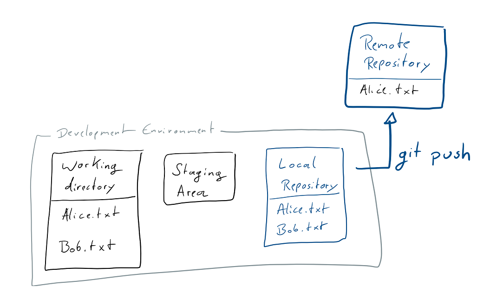

# Learn `git` concepts, not commands

**An interactive git tutorial meant to teach you how git works, not just which commands to execute.**

So, you want to use git, right? 

But you don't just want to learn commands, you want to understand what you're using? 

Then this is meant for you!

Let's get started!

---

> Based on the general concept from Rachel M. Carmena's blog post on [How to teach Git](https://rachelcarmena.github.io/2018/12/12/how-to-teach-git.html).
> 
> While I find many git tutorials on the internet to be too focused on what to do instead of how things work, the most invaluable resource for both (and source for this tutorial!) are the [git Book](https://git-scm.com/book/en/v2) and [Reference page](https://git-scm.com/docs). 
> 
> So if you're still interested when you're done here, go check those out! I do hope the somewhat different concept of this tutorial will aid you in understanding all the other git features detailed there.

---
- [Overview](#overview)
- [Getting a _Remote Repository_](#getting-a-_remote-repository_)
    - [Adding new things](#adding-new-things)
- [Making changes](#making-changes)
- [Branching](#branching)
- [Merging](#merging)
    - [Fast-Forward merging](#fast-forward-merging)
    - [Merging divergent branches](#merging-divergent-branches)
    - [Resolving conflicts](#resolving-conflicts)
- [Rebasing](#rebasing)
    - [Resolving conflicts](#resolving-conflicts-1)
- [Updating the _Dev Environment_ with remote changes](#updating-the-dev-environment-with-remote-changes)
- [Cherry-picking](#cherry-picking)
- [Rewriting history](#rewriting-history)
- [Reading history](#reading-history)
---

## Overview

In the picture below you see four boxes. One of them stands alone, while the other three are grouped together in what I'll call your _Development Environment_. 


We'll start with the one that's on its own though. The _Remote Repository_ is where you send your changes when you want to share them with other people, and where you get their changes from. If you've used other version control systems there's nothing interesting about that. 

The _Development Environment_ is what you have on your local machine. 
The three parts of it are your _Working Directory_, the _Staging Area_ and the _Local Repository_. We'll learn more about those as we start using git. 

Choose a place in which you want to put your _Development Environment_. 
Just go to your home folder, or wherever you like to put your projects. You don't need to create a new folder for your _Dev Environment_ though. 

## Getting a _Remote Repository_ 

Now we want to grab a _Remote Repository_ and put what's in it onto your machine. 

I'd suggest we use this one ([https://github.com/UnseenWizzard/git_training.git](https://github.com/UnseenWizzard/git_training.git) if you're not already reading this on github).

> To do that I can use `git clone https://github.com/UnseenWizzard/git_training.git`
> 
> But as following this tutorial will need you to get the changes you make in your _Dev Environment_ back to the _Remote Repository_, and github doesn't just allow anyone to do that to anyone's repo, you'll best create a _fork_ of it right now. There's a button to do that on the top right of this page. 

Now that you have a copy of my _Remote Repository_ of your own, it's time to get that onto your machine. 

For that we use `git clone https://github.com/{YOUR USERNAME}/git_training.git`

As you can see in the diagram below, this copies the _Remote Repository_ into two places, your _Working Directory_ and the _Local Repository_. 
Now you see how git is _distributed_ version control. The _Local Repository_ is a copy of the _Remote_ one, and acts just like it. The only difference is that you don't share it with anyone. 

What `git clone` also does, is create a new folder wherever you called it. There should be a `git_training` folder now. Open it. 


## Adding new things

Someone already put a file named `Alice.txt` into the _Remote Repository_. It's kind of lonely there, so let's create a new file and call it `Bob.txt`. 

What you've just done is add the file to your _Working Directory_. 
There are two kinds of files in your _Working Directory_: _tracked_ files that git knows about and _untracked_ files that git doesn't know about (yet). 

To see what's going on in your _Working Directory_ run `git status`, which will tell you what branch you're on, whether your _Local Repository_ is different from the _Remote_ and the state of _tracked_ and _untracked_ files. 

You'll see that `Bob.txt` is untracked, and `git status` even tells you how to change that. 
In the picture below you can see what happens when you follow the advice and execute `git add Bob.txt`: You've added the file to the _Staging Area_, where you collect all the changes you wish to put into _Repository_.


When you have added all your changes (which right now is only adding Bob), you're ready to _commit_ what you just did to the _Local Repository_. 

The collected changes that you _commit_ are some meaningful chunk of work, so when you now run `git commit` a text editor will open and allow you to write a message telling everything what you just did. When you save and close the message file, your _commit_ is added to the _Local Repository_.


You can also add your _commit message_ right there in the command line if you call `git commit` like this: `git commit -m "Add Bob"`. But because you want to write [good commit messages](https://chris.beams.io/posts/git-commit/) you really should take your time and use the editor.

Now your changes are in your local repository, which is a good place for them to be as long as no one else needs them or you're not yet ready to share them. 

In order to share your commits with the _Remote Repository_ you need to `push` them. 



Once you run `git push` the changes will be sent to the _Remote Repository_. In the diagram below you see the state after your `push`.


## Making changes
So far we've only added a new file. Obviously the more interesting part of version control is changing files. 

Have a look at `Alice.txt`. 

It actually contains some text, but `Bob.txt` doesn't, so lets change that and put `Hi!! I'm Bob. I'm new here.` in there. 

If you run `git status` now, you'll see that `Bob.txt` is _modified_. 
In that state the changes are only in your _Working Directory_.

If you want to see what has changed in your _Working Directory_ you can run `git diff`, and right now see this: 

```Diff
diff --git a/Bob.txt b/Bob.txt
index e69de29..3ed0e1b 100644
--- a/Bob.txt
+++ b/Bob.txt
@@ -0,0 +1 @@
+Hi!! I'm Bob. I'm new here.
```

Go ahead and `git add Bob.txt` like you've done before. As we know, this moves your changes to the _Staging Area_. 

I want to see the changes we just _staged_, so let's show the `git diff` again! You'll notice that this time the output is empty. This happens because `git diff` operates on the changes in your _Working Directory_ only. 

To show what changes are already_staged_, we can use `git diff --staged` and we'll see the same diff output as before. 

I just noticed that we put two exclamation marks after the 'Hi'. I don't like that, so lets change `Bob.txt` again, so that it's just 'Hi!' 

If we now run `git status` we'll see that there are two changes: the one we already _staged_ where we added text, and the one we just made, which is still only in the working directory. 

We can have a look at the `git diff` between the _Working Directory_ and what we've already moved to the _Staging Area_, to show what has changed since we last felt ready to _stage_ our changes for a _commit_. 

```Diff
diff --git a/Bob.txt b/Bob.txt
index 8eb57c4..3ed0e1b 100644
--- a/Bob.txt
+++ b/Bob.txt
@@ -1 +1 @@
-Hi!! I'm Bob. I'm new here.
+Hi! I'm Bob. I'm new here.
```

As the change is what we wanted, let's `git add Bob.txt` to stage the current state of the file. 

Now we're ready to `commit` what we just did. I went with `git commit -m "Add text to Bob"` because I felt that for such a small change writing one line would be enough. 

As we know, the changes are now in the _Local Repository_. 
We might still want to know what change we just _committed_ and what was there before. 

We can do that by comparing commits. 
Every commit in git has a unique hash by which it is referenced. 

If we have a look at the `git log` we'll not only see a list of all the commits with their _hash_ as well as _Author_ and _Date_, we also see the state of our _Local Repository_ and the latest local information about _remote branches_. 

Right now the `git log` looks something like this: 

```ShellSession
commit 87a4ad48d55e5280aa608cd79e8bce5e13f318dc (HEAD -> master)
Author: {YOU} <{YOUR EMAIL}>
Date:   Sun Jan 27 14:02:48 2019 +0100

    Add text to Bob

commit 8af2ff2a8f7c51e2e52402ecb7332aec39ed540e (origin/master, origin/HEAD)
Author: {YOU} <{YOUR EMAIL}>
Date:   Sun Jan 27 13:35:41 2019 +0100

    Add Bob

commit 71a6a9b299b21e68f9b0c61247379432a0b6007c 
Author: UnseenWizzard <nicola.riedmann@live.de>
Date:   Fri Jan 25 20:06:57 2019 +0100

    Add Alice

commit ddb869a0c154f6798f0caae567074aecdfa58c46
Author: Nico Riedmann <UnseenWizzard@users.noreply.github.com>
Date:   Fri Jan 25 19:25:23 2019 +0100

    Add Tutorial Text

      Changes to the tutorial are all squashed into this commit on master, to keep the log free of clutter that distracts from the tutorial

      See the tutorial_wip branch for the actual commit history
```

Here we see a few interesting things: 
* The first two commits are made by me.
* Your initial commit to add Bob is the current _HEAD_ of the _master_ branch on the _Remote Repository_. We'll look at this again when we talk about branches and getting remote changes.
* The latest commit in the _Local Repository_ is the one we just made, and now we know its hash.

> Note that the actual commit hashes will be different for you. If you want to know how exactly git arrives at those revision IDs have a look at [this interesting article](https://blog.thoughtram.io/git/2014/11/18/the-anatomy-of-a-git-commit.html).

To compare that commit and a previous one we can do `git diff <commit>^!` (where the `^!` tells git to compare the commit to the one that came before it). So in this case I run `git diff 87a4ad48d55e5280aa608cd79e8bce5e13f318dc^!`.

We can also do `git diff 8af2ff2a8f7c51e2e52402ecb7332aec39ed540e 87a4ad48d55e5280aa608cd79e8bce5e13f318dc` for the same result and in general to compare any two commits. Note that the format here is `git diff <from commit> <to commit>`, so our new commit comes second.

In the diagram below you again see the different stages of a change and the corresponding diff commands. 


Now that we're sure we made the change we wanted, go ahead and `git push`. 

## Branching

Another thing that makes git great, is the fact that working with branches is really easy and integral part of how you work with git.

In fact we've been working on a branch since we've started.

When you `clone` the _Remote Repository_ your _Dev Environment_ automatically starts on the repositories main branch, i.e. _master_.

Most work-flows with git include making your changes on a _branch_, before you `merge` them back into _master_. 
Usually you'll be working on your own _branch_, until you're done and confident in your changes which can then be merged into the _master_. 

> Many git repository managers like _GitLab_ and _GitHub_ also allow for branches to be _protected_, which means that not everyone is allowed to just `push` changes there. There the _master_ is usually protected by default. 

Don't worry, we'll get back to all of these things in more detail when we need them.  

Right now we want to create a branch to make some changes there. Maybe you just want to try something on your own and not mess with the working state on your _master_ branch, or you're not allowed to `push` to _master_.

Branches live in the _Local_ and _Remote Repository_. When you create a new branch, the branches contents will be a copy of the currently committed state of whatever branch you are currently working on. 

Let's make some change to `Alice.txt`! How about we put some text on the second line?  

We want to share that change, but not put it on _master_ right away, so let's create a branch for it using `git branch <branch name>`. 

To create a new branch called `change_alice` you can run `git branch change_alice`. 

This adds the new branch to the _Local Repository_. 

While your _Working Directory_ and _Staging Area_ don't really care about branches, you always `commit` to the branch you are currently on. 

You can think of _branches_ in git as pointers, pointing to a series of commits. When you `commit`, you add to whatever you're currently pointing to. 

Just adding a branch, doesn't directly take you there, it just creates such a pointer. 
In fact the state your _Local Repository_ is currently at, can be viewed as another pointer, called _HEAD_, which points to what branch and commit you are currently at. 

If that sounds complicated the diagrams below will hopefully help clear things up a bit:


To switch to our new branch you will have to use `git checkout change_alice`. What this does is simply move the _HEAD_ to the branch you specify.

> As you'll usually want to switch to a branch right after creating it, there is the convenient `-b` option available for the `checkout` command, which allows you to just directly `checkout` a _new_ branch, so you don't have to create it beforehand. 

> So to create and switch to our `change_alice` branch, we could also just have called `git checkout -b change_alice`.


You'll notice that your _Working Directory_ hasn't changed and the fact that we've _modified_ `Alice.txt` is not related to the branch we're on yet. Now you can `add` and `commit` the change to `Alice.txt` just like we did on the _master_ before, which will _stage_ (at which point it's still unrelated to the branch) and finally _commit_ your change to the `change_alice` branch. 

There's just one thing you can't do yet. Try to `git push` your changes to the _Remote Repository_.

You'll see the following error and - as git is always ready to help - a suggestion how to resolve the issue: 

```ShellSession
fatal: The current branch change_alice has no upstream branch.
To push the current branch and set the remote as upstream, use

    git push --set-upstream origin change_alice 
```

But we don't just want to blindly do that. We're here to understand what's actually going on. So what are _upstream branches_ and _remotes_?

Remember when we `cloned` the _Remote Repository_ a while ago? At that point it didn't only contain this tutorial and `Alice.txt` but actually two branches. 

The _master_ we just went ahead and started working on, and the one I called "tutorial_wip" on which I commit all the changes I make to this tutorial. 

When we copied the things in the _Remote Repository_ into your _Dev Environment_ a few extra steps happened under the hood. 

Git setup the _remote_ of your _Local Repository_ to be the _Remote Repository_ you cloned and gave it the default name `origin`. 

>Your _Local Repository_ can track several _remotes_ and they can have different names, but we'll stick to the `origin` and nothing else for this tutorial. 

Then it copied the two remote branches into your _Local Repository_ and finally it `checkout`ed _master_ for you. 

When doing that, another implicit step happens. When you `checkout` a branch name that has an exact match in the remote branches, you will get a new _local_ branch that is linked to the _remote_ branch. The _remote_ branch is the _upstream branch_ of your _local_ one. 

In the diagrams earlier you can see just the local branches you have. You can see that list of local branches by running `git branch`. 

If you want to also see the _remote_ branches your _Local Repository_ knows, you can use `git branch -a` to list all of them.


Now we can call the suggested `git push --set-upstream origin change_alice`, and `push` the changes on our branch to a new _remote_. This will create a `change_alice` branch on the _Remote Repository_ and set our _local_ `change_alice` to track that new branch. 

> There is another option if we actually want our branch to track something that already exists on the _Remote Repository_. Maybe a colleague has already pushed some changes, while we were working on some related issue on our local branch, and we'd like to integrate the two. Then we could just set the _upstream_ for our `change_alice` branch to a new _remote_ by using `git branch --set-upstream-to=origin/change_alice` and from there to track the _remote_ branch.

After that went through have a look at your _Remote Repository_ on github, your branch will be there, ready for other people to see and work with. 

We'll get to how you can get other people's changes into your _Dev Environment_ soon, but first we'll work a bit more with branches, to introduce all the concepts that also come into play when we get new things from the _Remote Repository_. 

## Merging

As you and everyone else will generally be working on branches, we need to talk about how to get changes from one branch into the other by _merging_ them. 

<!-- NO CONFLICT -->
We've just changed `Alice.txt` on the `change_alice` branch, and I'd say we're happy with the changes we made. 

If you go and `git checkout master`, the `commit` we made on the other branch will not be there. To get the changes into master we need to `merge` the `change_alice` branch _into_ master. 

Note that you always `merge` a particular branch _into_ the one you're currently at. 

### Fast-Forward merging

As we've already `checked out` _master_, we can now `git merge change_alice`. 

As there are no other _conflicting_ changes to `Alice.txt`, and we've changed nothing on _master_, this will go through without a hitch in what is called a _fast forward_ merge. 

In the diagrams below, you can see that this just means that the _master_ pointer can simply be advanced to where the _change_alice_ one already is. 

The first diagram shows the state before our `merge`, _master_ is still at the commit it originally was, and on the other branch we've made one more commit. 


The second diagram shows what has changed with our `merge`.


### Merging divergent branches

Let's try something more complex. 

Add some text on a new line to `Bob.txt` on _master_ and commit it. 

Then `git checkout change_alice`, change `Alice.txt` and commit. 

In the diagram below you see how our commit history now looks. Both _master_ and `change_alice` originated from the same commit, but since then they _diverged_, each having their own additional commit. 


If you now switch back to master (`git checkout master`) and do `git merge change_alice` a fast-forward merge is not possible. Instead your favorite text editor will open and allow you to change the message of the `merge commit` git is about to make in order to get the two branches back together. You can just go with the default message right now. The diagram below shows the state of our git history after we the `merge`.


The new commit introduces the changes that we've made on the `change_alice` branch into master. 

As you'll remember from before, revisions in git, aren't only a snapshot of your files but also contain information on where they came from from. Each `commit` has one or more parent commits. Our new `merge` commit, has both the last commit from _master_ and the commit we made on the other branch as its parents.

### Resolving conflicts

So far our changes haven't interfered with each other. 

Let's introduce a _conflict_ and then _resolve_ it. 

Create and `checkout` a new branch. You know how, but maybe try using `git checkout -b` to make your life easier. 
I've called mine `bobby_branch`.

On the branch we'll make a change to `Bob.txt`. 
The first line should still be `Hi!! I'm Bob. I'm new here.`. Change that to `Hi!! I'm Bobby. I'm new here.`

Stage and then `commit` your change, before you `checkout` _master_ again. Here we'll change that same line to `Hi!! I'm Bob. I've been here for a while now.` and `commit` your change. 

Now it's time to `merge` the new branch into _master_. 
When you try that, you'll see the following output:

```ShellSession
Auto-merging Bob.txt
CONFLICT (content): Merge conflict in Bob.txt
Automatic merge failed; fix conflicts and then commit the result.
```
The same line has changed on both of the branches, and git can't handle this on its own. 

If you run `git status` you'll get all the usual helpful instructions on how to continue. 

First we have to resolve the conflict by hand. 

> For an easy conflict like this one your favorite text editor will do fine. For merging large files with lots of changes a more powerful tool will make your life much easier, and I'd assume your favorite IDE comes with version control tools and a nice view for merging. 

If you open `Bob.txt` you'll see something similar to this (I've truncated whatever we might have put on the second line before): 

```Diff
<<<<<<< HEAD
Hi! I'm Bob. I've been here for a while now.
=======
Hi! I'm Bobby. I'm new here.
>>>>>>> bobby_branch
[... whatever you've put on line 2]
```

On top you see what has changed in `Bob.txt` on the current HEAD, below you see what has changed in the branch we're merging in.

To resolve the conflict by hand, you'll just need to make sure that you end up with some reasonable content and without the special lines git has introduced to the file.

So go ahead and change the file to something like this: 

```
Hi! I'm Bobby. I've been here for a while now.
[...]
```

From here what we're doing is exactly what we'd do for any changes. 
We _stage_ them when we `add Bob.txt`, and then we `commit`. 

We already know the commit for the changes we've made to resolve the conflict. It's the _merge commit_ that is always present when merging. 

Should you ever realize in the middle of resolving conflicts that you actually don't want to follow through with the `merge`, you can just `abort` it by running `git merge --abort`. 

## Rebasing

Git has another clean way to integrate changes between two branches, which is called `rebase`.

We still recall that a branch is always based on another. When you create it, you _branch away_ from somewhere. 

In our simple merging example we branched from _master_ at a specific commit, then committed some changes on both _master_ and the `change_alice` branch. 

When a branch is diverging from the one it's based on and you want to integrate the latest changes back into your current branch, `rebase` offers a cleaner way of doing that than a `merge` would. 

As we've seen, a `merge` introduces a _merge commit_ in which the two histories get integrated again. 

Viewed simply, rebasing just changes the point in history (the commit) your branch is based on. 

To try that out, let's first checkout the _master_ branch again, then create/checkout a new branch based on it. 
I called mine `add_patrick` and I added a new `Patrick.txt` file and committed that with the message 'Add Patrick'. 

When you've added a commit to the branch, get back to _master_, make a change and commit it. I added some more text to `Alice.txt`.  

Like in our merging example the history of these two branches diverges at a common ancestor as you can see in the diagram below. 


Now let's `checkout add_patrick` again, and get that change that was made on _master_ into the branch we are working on! 

When we `git rebase master`, we re-base our `add_patrick` branch on the current state of the _master_ branch. 

The output of that command gives us a nice hint at what is happening in it: 

```ShellSession
First, rewinding head to replay your work on top of it...
Applying: Add Patrick
```

As we remember _HEAD_ is the pointer to the current commit we're at in our _Dev Environment_. 

It's pointing to the same place as `add_patrick` before the rebase starts. For the rebase, it then first moves back to the common ancestor, before moving to the current head of the branch we want to re-base ours on. 

So _HEAD_ moves from the _0cfc1d2_ commit, to the _7639f4b_ commit that is at the head of _master_. 
Then rebase applies every single commit we made on our `add_patrick` branch to that. 

To be more exact what _git_ does after moving _HEAD_ back to the common ancestor of the branches, is to store parts of every single commit you've made on the branch (the `diff` of changes, and the commit text, author, etc.). 

After that it does a `checkout` of the latest commit of the branch you're rebasing on, and then applies each of the stored changed __as a new commit__ on top of that.

So in our original simplified view, we'd assume that after the `rebase` the _0cfc1d2_ commit doesn't point to the common ancestor anymore in its history, but points to the head of master. 
In fact the _0cfc1d2_ commit is gone, and the `add_patrick` branch starts with a new _0ccaba8_ commit, that has the latest commit of _master_ as its ancestor. 
We made it look, like our `add_patrick` was based on the current _master_ not an older version of it, but in doing so we re-wrote the history of the branch.  
At the end of this tutorial we'll learn a bit more about re-writing history and when it's appropriate and inappropriate to do so. 


`Rebase` is an incredibly powerful tool when you're working on your own development branch which is based on a shared branch, e.g. the _master_. 

Using rebase you can make sure that you frequently integrate the changes other people make and push to _master_, while keeping a clean linear history that allows you to do a `fast-forward merge` when it's time to get your work into the shared branch. 

Keeping a linear history also makes reading or looking at (try out `git log --graph` or take a look at the branch view of _GitHub_ or _GitLab_) commit logs much more useful than having a history littered with _merge commits_, usually just using the default text.

### Resolving conflicts

Just like for a `merge` you may run into conflicts, if you run into two commits changing the same parts of a file. 

However when you encounter a conflict during a `rebase` you don't fix it in an extra _merge commit_, but can simply resolve it in the commit that is currently being applied. 
Again, basing your changes directly on the current state of the original branch. 

Actually resolving conflicts while you `rebase` is very similar to how you would do it for a `merge`, so refer back to that section if you're not sure anymore how to do it. 

The only distinction is, that as you're not introducing a _merge commit_ there is no need to `commit` your resolution. Simply `add` the changes to the _Staging Environment_ and then `git rebase --continue`. The conflict will be resolved in the commit that was just being applied. 

As when merging, you can always stop and drop everything you've done so far when you `git rebase --abort`. 

## Updating the _Dev Environment_ with remote changes

So far we've only learned how to make and share changes.

That fits what you'll do if you're just working on your own, but usually there'll be a lot of people that do just the same, and we're gonna want to get their changes from the _Remote Repository_ into our _Dev Environment_ somehow.

Because it has been a while, lets have another look at the components of git: 


Just like your _Dev Environment_ everyone else working on the same source code has theirs. 


All of these _Dev Environments_ have their own _working_ and _staged_ changes, that are at some point `committed` to the _Local Repository_ and finally `pushed` to the _Remote_. 

For our example, we'll use the online tools offered by _GitHub_, to simulate someone else making changes to the _remote_ while we work. 

Go to your `fork` of this repo on [github.com](https://www.github.com) and open the `Alice.txt` file. 

Find the edit button, make a change, and commit it via the website. 

 

In this repository I have added a remote change to `Alice.txt` on a branch called `fetching_changes_sample`, but in your version of the repository you can of course just change the file on `master`.

### _Fetching_ Changes

We still remember that when you `git push`, you synchronize changes made to the _Local Repository_ into the _Remote Repository_. 

To get changes made to the _Remote_ into your _Local Repository_ you use `git fetch`. 

This gets any changes on the remote - both commits and branches - into your _Local Repository_.

Note that at this point, changes aren't integrated into the local branches and thus the _Working Directory_ and _Staging Area_ yet.


If you run `git status` now, you'll see another great example of git commands telling you exactly what is going on: 

```ShellSession
> git status
On branch fetching_changes_sample
Your branch is behind 'origin/fetching_changes_sample' by 1 commit, and can be fast-forwarded.
  (use "git pull" to update your local branch)
```

### _Pulling_ Changes

As we have no _working_ or _staged_ changes, we could just execute `git pull` now to get the changes from the _Repository_ all the way into our working area. 

> Pulling will implicitly also `fetch` the _Remote Repository_, but sometimes it is a good idea to do a `fetch` on its own. 
> For example when you want to synchronize any new _remote_ branches, or when you want to make sure your _Local Repository_ is up to date before you do a `git rebase` on something like `origin/master`.


Before we `pull`, lets change a file locally to see what happens. 

Lets also change `Alice.txt` in our _Working Directory_ now! 

If you now try to do a `git pull` you'll see the following error: 

```ShellSession
> git pull
Updating df3ad1d..418e6f0
error: Your local changes to the following files would be overwritten by merge:
        Alice.txt
Please commit your changes or stash them before you merge.
Aborting
```

You can not `pull` in any changes, while there are modifications to files in the _Working Directory_ that are also changed by the commits you're `pull`ing in. 

While one way around this is, to just get your changes to a point where you're confident in them, `add` them to the _Staging Environment_, before you finally `commit` them, this is a good moment to learn about another great tool, the `git stash`. 

### Stashing changes

If at any point you have local changes that you do not yet want to put into a commit, or want to store somewhere while you try some different angle to solve a problem, you can `stash` those changes away. 

A `git stash` is basically a stack of changes on which you store any changes to the _Working Directory_. 

The commands you'll mostly use are `git stash` which places any modifications to the _Working Directory_ on the stash, and `git stash pop` which takes the latest change that was stashed and applies it the to the _Working Directory_ again. 

Just like the stack commands it's named after, `git stash pop` removes the latest stashed change before applying it again. 
If you want to keep the stashed changes, you can use `git stash apply`, which doesn't remove them from the stash before applying them. 

To inspect your current `stash` you can use `git stash list` to list the individual entries, and `git stash show` to show the changes in the latest entry on the `stash`. 

> Another nice convenience command is `git stash branch {BRANCH NAME}`, which creates a branch, starting from the HEAD at the moment you've stashed the changes, and applies the stashed changes to that branch.

Now that we know about `git stash`, lets run it to remove our local changes to `Alice.txt` from the _Working Directory_, so that we can go ahead and `git pull` the changes we've made via the website. 

After that, let's `git stash pop` to get the changes back. 
As both the commit we `pull`ed in and the `stash`ed change modified `Alice.txt` you will have to resolve the conflict, just how you would in a  `merge` or `rebase`. When you're done, `add` and `commit` the change. 

### Pulling with Conflicts

Now that we've understood how to `fetch` and `pull` _Remote Changes_ into our _Dev Environment_, it's time to create some conflicts! 

Do not `push` the commit that changed `Alice.txt` and head back to your _Remote Repository_ on [github.com](https://www.github.com). 

There we're also going to change `Alice.txt` again and commit the change. 

Now there are actually two conflicts between our _Local_ and _Remote Repositories_. 

Don't forget to run `git fetch` to see the remote change without `pull`ing it in right away. 

If you now run `git status` you will see, that both branches have one commit on them that differs from the other. 

```ShellSession
> git status
On branch fetching_changes_sample
Your branch and 'origin/fetching_changes_sample' have diverged,
and have 1 and 1 different commits each, respectively.
  (use "git pull" to merge the remote branch into yours)
```

In addition we've changed the same file in both of those commits, to introduce a `merge` conflict we'll have to resolve. 

When you `git pull` while there is a difference between the _Local_ and _Remote Repository_ the exact same thing happens as when you `merge` two branches. 

Additionally, you can think of the relationship between branches on the _Remote_ and the one in the _Local Repository_ as a special case of creating a branch based on another one. 
A local branch is based on a branches' state on the _Remote_ from the time you last `fetched` it. 

Thinking that way, the two options you have to get _remote_ changes make a lot of sense: 

When you `git pull`, the _Local_ and _Remote_ versions of a branch will be `merged`. Just like `merging` branches, this will introduce a _merge_ commit. 

As any _local_ branch is based on its respective _remote_ version, we can also `rebase` it, so that any changes we may have made locally, appear as if they were based on the latest version that is available in the _Remote Repository. 
To do that, we can use `git pull --rebase` (or the shorthand `git pull -r`). 

As detailed in the section on [Rebasing](#rebasing), there is a benefit in keeping a clean linear history, which is why I would strongly recommend that whenever you `git pull` you do a `git pull -r`. 

> You can also tell git to use `rebase` instead of `merge` as its default strategy when your `git pull`, by setting the `pull.rebase` flag with a command like this `git config --global pull.rebase true`.

If you haven't already run `git pull` when I first mentioned it a few paragraphs ago, let's now run `git pull -r` to get the remote changes while making it look like our new commit just happened after them. 

Of course like with a normal `rebase` (or `merge`) you'll have to resolve the conflict we introduced for the `git pull` to finish. 

## Cherry-picking

> Congratulations! You've made it to the more advanced features! 

> By now you understand how to use all the typical git commands and more importantly how they work. 
>
>This will hopefully make the following concepts much simpler to understand than if I just told you what commands to type in. 
>
>So let's head right in an learn how to `cherry-pick` commits!

From earlier sections you still remember roughly what a `commit` is made off, right? 

And how your commits are applied as new commits with the same _change set_ and _message_ when you [`rebase`](#rebasing) a branch? 

Whenever you want to just take a few choice changes from one branch and apply them to another branch, you want to `cherry-pick` these commits and put them on your branch. 

That is exactly what `git cherry-pick` allows you to do with either single commits or a range of commits. 

Just like during a `rebase` this will actually put the changes from these commits into a new commit on your current branch. 

Lets have a look at examples for each `cherry-pick`ing: with one or more commits. 

The figure below shows three branches before we have done anything. Let's assume we really want to get some changes from the `add_patrick` branch into the `change_alice` branch. Sadly they haven't made it into master yet, so we can't just `rebase` onto master to get those changes (along with any other changes on the other branch, that we might not even want). 


So let's just `git cherry-pick` the commit _63fc421_. 
The figure below visualizes what happens when we run `git cherry-pick 63fc421`


As you can see, a new commit with the changes we wanted shows up on branch. 

> At this point note that like with any other kind of getting changes onto a branch that we've seen before, any conflicts that arise during a `cherry-pick` will have to be _resolved_ by us, before the command can go through. 
>
> Also like all other commands you can either `--continue` a `cherry-pick` when you've resolved conflicts, or decide to `--abort` the command entirely.

The figure below visualizes `cherry-pick`ing a range of commits instead of a single one. You can simply do that by calling the command in the form `git cherry-pick <from>..<to>` or in our example below as `git cherry-pick 0cfc1d2..41fbfa7`.


## Rewriting history
> I'm repeating myself now, but you still remember [`rebase`](#rebasing) well enough right? Otherwise quickly jump back to that section, before continuing here, as we'll use what we already know while learning how to change history!

As you know a `commit` basically contains your changes, a message and few other things. 

The 'history' of a branch is made up of all its commits. 

But lets say you've just made a `commit` and then notice, that you've forgotten to add a file, or you made a typo and the change leaves you with broken code. 

We'll briefly look at two things we could do to fix that, and make it look like it never happened. 

Let's switch to a new branch with `git checkout -b rewrite_history`. 

Now make some changes to both `Alice.txt` and `Bob.txt`, and then `git add Alice.txt`. 

Then `git commit` using a message like "This is history" and you're done. 

Wait, did I say we're done? No, you'll clearly see that we've made some mistakes here: 

* We forgot to add the changes to `Bob.txt`
* We didn't write a [good commit message](https://chris.beams.io/posts/git-commit/)

<!-- amending -->
### Amending the last Commit
One way to fix both of these in one go would be to `amend` the commit we've just made. 

`Amend`ing the latest commit basically works just like making a new one. 

Before we do anything, take a look at your latest commit, with `git show {COMMIT}`. Put either the commit hash (which you'll probably still see in your command line from the `git commit` call, or in the `git log`), or just _HEAD_.

Just like in the `git log` you'll see the message, author, date and of course changes. 

Now let's `amend` what we've done in that commit. 

`git add Bob.txt` to get the changes to the _Staging Area_, and then `git commit --amend`. 

What happens next is your latest commit being unrolled, the new changes from the _Staging Area_ added to the existing one, and the editor for the commit message opening. 

In the editor you'll see the previous commit message. 
Feel free to change it to something better. 

After you're done, take another look at the latest commit with `git show HEAD`.

As you've certainly expected by now, the commit hash is different. The original commit is gone, and in its place there is a new one, with the combined changes and new commit message. 

> Note how the other commit data like author and date are unchanged from the original commit. You can mess with those too, if you really want, by using the extra `--author={AUTHOR}` and `--date={DATE}` flags when amending. 

Congratulations! You've just successfully re-written history for the first time! 

### Interactive Rebase
<!-- squashing -->
Generally when we `git rebase`, we `rebase` onto a branch. When we do something like `git rebase origin/master`, what actually happens, is a rebase onto the _HEAD_ of that branch. 

In fact if we felt like it, we could `rebase` onto any commit. 

> Remember that a commit contains information about the history that came before it

Like many other commands `git rebase` has an _interactive_ mode. 

Unlike most others, the _interactive_ `rebase` is something you'll probably be using a lot, as it allows you to change history as much as you want. 

Especially if you follow a work-flow of making many small commits of your changes, which allow you to easily jump back if you made a mistake, _interactive_ `rebase` will be your closest ally. 

_Enough talk! Lets do something!_

Switch back to your _master_ branch and `git checkout` a new branch to work on. 

As before, we'll make some changes to both `Alice.txt` and `Bob.txt`, and then `git add Alice.txt`. 

Then we `git commit` using a message like "Add text to Alice". 

Now instead of changing that commit, we'll `git add Bob.txt` and `git commit` that change as well. As message I used "Add Bob.txt". 

And to make things more interesting, we'll make another change to `Alice.txt` which we'll `git add` and `git commit`. As a message I used "Add more text to Alice". 

If we now have a look at the branch's history with `git log` (or for just a quick look preferably with `git log --oneline`), we'll see our three commits on top of whatever was on your _master_. 

For me it looks like this: 
```ShellSession
> git log --oneline
0b22064 (HEAD -> interactiveRebase) Add more text to Alice
062ef13 Add Bob.txt
9e06fca Add text to Alice
df3ad1d (origin/master, origin/HEAD, master) Add Alice
800a947 Add Tutorial Text
```

There's two things we'd like to fix about this, which for the sake of learning different things, will be a bit different than in the previous section on `amend`: 

* Put both changes to `Alice.txt` in a single commit
* Consistently name things, and remove the _.txt_ from the message about `Bob.txt`

To change the three new commits, we'll want to rebase onto the commit just before them. That commit for me is `df3ad1d`, but we can also reference it as the third commit from the current _HEAD_ as `HEAD~3`

To start an _interactive_ `rebase` we use `git rebase -i {COMMIT}`, so let's run `git rebase -i HEAD~3`

What you'll see is your editor of choice showing something like this: 

```bash
pick 9e06fca Add text to Alice
pick 062ef13 Add Bob.txt
pick 0b22064 Add more text to Alice

# Rebase df3ad1d..0b22064 onto df3ad1d (3 commands)
#
# Commands:
# p, pick = use commit
# r, reword = use commit, but edit the commit message
# e, edit = use commit, but stop for amending
# s, squash = use commit, but meld into previous commit
# f, fixup = like "squash", but discard this commit's log message
# x, exec = run command (the rest of the line) using shell
# d, drop = remove commit
#
# These lines can be re-ordered; they are executed from top to bottom.
#
# If you remove a line here THAT COMMIT WILL BE LOST.
#
# However, if you remove everything, the rebase will be aborted.
#
# Note that empty commits are commented out
```

Note as always how `git` explains everything you can do right there when you call the command. 

The _Commands_ you'll probably be using most are `reword`, `squash` and `drop`. (And `pick` but that one's there by default)

Take a moment to think about what you see and what we're going to use to achieve our two goals from above. I'll wait. 

Got a plan? Perfect!

Before we start making changes, take note of the fact, that the commits are listed from oldest to newest, and thus in the opposite direction of the `git log` output. 

I'll start off with the easy change and make it so we get to change the commit message of the middle commit. 

```bash
pick 9e06fca Add text to Alice
reword 062ef13 Add Bob.txt
pick 0b22064 Add more text to Alice

# Rebase df3ad1d..0b22064 onto df3ad1d (3 commands)
[...]
```

Now to getting the two changes of `Alice.txt` into one commit. 

Obviously what we want to do is to `squash` the later of the two into the first one, so let's put that command in place of the `pick` on the second commit changing `Alice.txt`. For me in the example that's _0b22064_.

```bash
pick 9e06fca Add text to Alice
reword 062ef13 Add Bob.txt
squash 0b22064 Add more text to Alice

# Rebase df3ad1d..0b22064 onto df3ad1d (3 commands)
[...]
```

Are we done? Will that do what we want? 

It wont, right? As the comments in the file tell us: 

```bash
# s, squash = use commit, but meld into previous commit
```

So what we've done so far, will merge the changes of the second Alice commit, with the Bob commit. That's not what we want. 

Another powerful thing we can do in an _interactive_ `rebase` is changing the order of commits. 

If you've read what the comments told you carefully, you already know how: Simply move the lines!

Thankfully you're in your favorite text editor, so go ahead and move the second Alice commit after the first.

```bash
pick 9e06fca Add text to Alice
squash 0b22064 Add more text to Alice
reword 062ef13 Add Bob.txt

# Rebase df3ad1d..0b22064 onto df3ad1d (3 commands)
[...]
```

That should do the trick, so close the editor to tell `git` to start executing the commands. 

What happens next is just like a normal `rebase`: starting with the commit you've referenced when starting it, each of the commits you have listed will be applied one after the other. 

> Right now it won't happen, but when you re-order actual code changes, it may happen, that you run into conflicts during the `rebase`. After all you've possibly mixed up changes that were building on each other. 
>
> Just [resolve](#resolving-conflicts) them, as you would usually. 

After applying the first commit, the editor will open and allow you to put a new message for the commit combining the changes to `Alice.txt`. I've thrown away the text of both commits and put "Add a lot of very important text to Alice". 

After you close the editor to finish that commit, it will open again to allow you to change the message of the `Add Bob.txt` commit. Remove the ".txt" and continue by closing the editor. 

That's it! You've rewritten history again. This time a lot more substantially than when `amend`ing!

If you look at the `git log` again, you'll see that there are two new commits in place of the three that we had previously. But by now you're used to what `rebase` does to commits and have expected that. 

```
> git log --oneline
105177b (HEAD -> interactiveRebase) Add Bob
ed78fa1 Add a lot very important text to Alice
df3ad1d (origin/master, origin/HEAD, master) Add Alice
800a947 Add Tutorial Text
```

<!-- changing meta data?>

<!-- force pushing -->
### Public History, why you shouldn't rewrite it, and how to still do it safely

As noted before, changing history is a incredibly useful part of any work-flow that involves making a lot of small commits while you work. 

While all the small atomic changes make it very easy for you to e.g. verify that with each change your test-suite still passes and if it doesn't, remove or amend just these specific changes, the 100 commits you've made to write `HelloWorld.java` are probably not something you want to share with people. 

Most likely what you want to share with them, are a few well formed changes with nice commit messages telling your colleagues what you did for which reason. 

As long as all those small commits only exist in your _Dev Environment_, you're perfectly safe to do a `git rebase -i` and change history to your hearts content. 

Things get problematic when it comes to changing _Public History_. That means anything that has already made it to the _Remote Repository_.

At this point is has become _public_ and other people's branches might be based on that history. That really makes it something you generally don't want to mess with. 

The usual advice is to "Never rewrite public history!" and while I repeat that here, I've got to admit, that there is a decent amount of cases in which you might still want to rewrite _public history_. 

In all of theses cases that history isn't 'really' _public_ though. You most certainly don't want to go rewriting history on the _master_ branch of an open source project, or something like your company's _release_ branch. 

Where you might want to rewrite history are branches that you've `push`ed just to share with some colleagues. 

You might be doing trunk-based development, but want to share something that doesn't even compile yet, so you obviously don't want to put that on the main branch knowingly. 
Or you might have a work-flow in which you share feature branches. 

Especially with feature branches you hopefully `rebase` them onto the current _master_ frequently. But as we know, a `git rebase` adds our branch's commits as _new_ commits on top of the thing we're basing them on. This rewrites history. And in the case of a shared feature branch it rewrites _public history_. 

So what should we do if we follow the "Never rewrite public history" mantra? 

Never rebase our branch and hope it still merges into _master_ in the end? 

Not use shared feature branches? 

Admittedly that second one is actually a reasonable answer, but you might still not be able to do that. So the only thing you can do, is to accept rewriting the _public history_ and  `push` the changed history to the _Remote Repository_. 

If you just do a `git push` you'll be notified that you're not allowed to do that, as your _local_ branch has diverged from the _remote_ one. 

You will need to `force` pushing the changes, and overwrite the remote with your local version. 

As I've highlighted that so suggestively, you're probably ready to try `git push --force` right now. You really shouldn't do that if you want to rewrite _public history_ safely though!

You're much better off using `--force`'s more careful sibling `--force-with-lease` ! 

`--force-with-lease` will check if your _local_ version of the _remote_ branch and the actual _remote_ match, before `push`ing. 

By that you can ensure that you don't accidentally wipe any changes someone else may have `push`ed while you where rewriting history!


And on that note I'll leave you with a slightly changed mantra: 

_Don't rewrite public history unless you're really sure about what you're doing. And if you do, be safe and force-with-lease._


## Reading history

Knowing about the differences between the areas in your _Dev Environment_ - especially the _Local Repository_ - and how commits and the history work, doing a `rebase` should not be scary to you. 

Still sometimes things go wrong. You may have done a `rebase` and accidentally accepted the wrong version of file when resolving a conflict. 

Now instead of the feature you've added, there's just your colleagues added line of logging in a file. 

Luckily `git` has your back, by having a built in safety feature called the _Reference Logs_ AKA `reflog`.

Whenever any _reference_ like the tip of a branch is updated in your _Local Repository_ a _Reference Log_ entry is added. 

So there's a record of any time you make a `commit`, but also of when you `reset` or otherwise move the `HEAD` etc. 

Having read this tutorial so far, you see how this might come in handy when we've messed up a `rebase`, right? 

We know that a `rebase` moves the `HEAD` of our branch to the point we're basing it on and the applies our changes. An interactive `rebase` works similarly, but might do things to those commits like _squashing_ or _rewording_ them. 

If you're not still on the branch on which we practiced [interactive rebase](#interactive-rebase), switch to it again, as we're about to practice some more there. 

Lets have a look at the `reflog` of the things we've done on that branch by - you've guessed it - running `git reflog`. 

You'll probably see a lot of output, but the first few lines on the top should be similar to this: 

```bash
> git reflog
105177b (HEAD -> interactiveRebase) HEAD@{0}: rebase -i (finish): returning to refs/heads/interactiveRebase
105177b (HEAD -> interactiveRebase) HEAD@{1}: rebase -i (reword): Add Bob
ed78fa1 HEAD@{2}: rebase -i (squash): Add a lot very important text to Alice
9e06fca HEAD@{3}: rebase -i (start): checkout HEAD~3
0b22064 HEAD@{4}: commit: Add more text to Alice
062ef13 HEAD@{5}: commit: Add Bob.txt
9e06fca HEAD@{6}: commit: Add text to Alice
df3ad1d (origin/master, origin/HEAD, master) HEAD@{7}: checkout: moving from master to interactiveRebase
```

There it is. Every single thing we've done, from switching to the branch to doing the `rebase`. 

Quite cool to see the things we've done, but useless on its own if we messed up somewhere, if it wasn't for the references at the start of each line. 

If you compare the `reflog` output to when we looked at the `log` the last time, you'll see those points relate to commit references, and we can use them just like that. 

Let's say we actually didn't want to do the rebase. How do we get rid of the changes it made? 

We move `HEAD` to the point before the `rebase` started with a `git reset 0b22064`. 

> `0b22064` is the commit before the `rebase` in my case. More generally you can also reference it as _HEAD four changes ago_ via `HEAD@{4}`. Note that should you have switched branches in between or done any other thing that creates a log entry, you might have a higher number there.

If you take a look at the `log` now, you'll see the original state with three individual commits restored. 

But let's say we now realize that's not what we wanted. The `rebase` is fine, we just don't like how we changed the message of the Bob commit. 

We could just do another `rebase -i` in the current state, just like we did originally. 

Or we use the reflog and jump back to after the rebase and `amend` the commit from there. 

But by now you know how to do either of that, so I'll let you try that on your own. And in addition you also know that there's the `reflog` allowing you to undo most things you might end up doing by mistake. 
